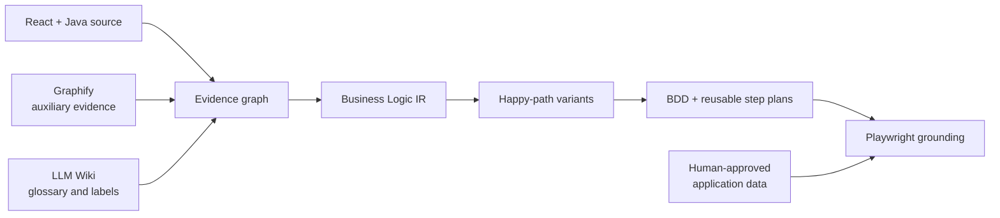

<div align="center">

<h1>Agentic BDD Flowctl</h1>

<p><strong>Compile source code into provable business journeys, composable BDD, and Playwright-ready execution contracts.</strong></p>

<p>
  <a href="https://github.com/TarunKurella/agentic-bdd-flowctl/actions/workflows/ci.yml"></a>
  
  
  
</p>

<p>
  <a href="#quick-start">Quick start</a> ·
  <a href="#how-flow-discovery-works">How it works</a> ·
  <a href="#business-logic-ir">Artifacts</a> ·
  <a href="#end-to-end-workflow">Workflow</a> ·
  <a href="docs/architecture.md">Architecture</a>
</p>

</div>

`flowctl` is a developer-facing, source-grounded compiler for unfamiliar React/Java applications. It discovers successful business journeys, proves how each UI action reaches a backend operation, separates materially different happy paths, and generates traceable BDD with stable reusable step contracts.

> [!IMPORTANT]
> Version 0.2 focuses on trustworthy flow discovery and happy-path generation. It is not a browser-only QA recorder, does not invent UAT data, and does not yet claim to find implementation bugs.

## Why Flowctl?

Asking an AI assistant to “open the app and generate tests” gives it one browser state and too little business context. Flowctl first compiles an inspectable model from source, then lets Playwright confirm controls and transitions without becoming the source of business meaning.

| You need | Flowctl provides |
| --- | --- |
| End-to-end business flows | Source-to-operation proof across React routes, handlers, HTTP clients and Spring endpoints |
| Multiple meaningful happy paths | Behavior-based variants instead of a Cartesian explosion of test data |
| Maintainable BDD | Stable page, field, action, constraint and requirement IDs with reusable step delegates |
| Safe agent automation | A state-aware CLI that returns the next permitted agent or human action |
| Realistic UAT data | Explicit requests for approved identities, entities and product codes—never hallucinated values |
| Playwright implementation | Witness-ordered manifests, adapter contracts and runtime observations with lineage digests |

## Quick start

Requirements: Node.js 20 or newer.

```bash
git clone https://github.com/TarunKurella/agentic-bdd-flowctl.git
cd agentic-bdd-flowctl
npm ci
npm run check

# Compile the included React/Java fixture and generate its BDD.
npm run demo
npm run demo:bdd

# Inspect the discovered variants and the next safe action.
node --import tsx src/cli.ts flows list \
  --config examples/account-opening/flowctl.config.yaml
node --import tsx src/cli.ts agent guide \
  --config examples/account-opening/flowctl.config.yaml --json

# Inspect the latest compiler/runtime run and its exact output paths.
node --import tsx src/cli.ts runs show latest \
  --config examples/account-opening/flowctl.config.yaml
```

The proof fixture currently discovers two materially different submission journeys—personal and joint—not permutations of every possible input value. Generated files appear under `examples/account-opening/.flowctl/` and remain untracked.

For your own application:

```bash
# Optional but recommended when graphify.graph is configured. The official
# package name has two ys; the executable has one.
uv tool install graphifyy
graphify extract /path/to/application --code-only --no-cluster

cp flowctl.config.example.yaml flowctl.config.yaml
node --import tsx src/cli.ts doctor --config flowctl.config.yaml --json
node --import tsx src/cli.ts agent guide --config flowctl.config.yaml --json
```

`agent guide` is the control loop. It reports the current phase, blockers and ordered `nextActions`. An assistant performs only the first applicable action, reruns the guide, and stops whenever `executor: human` is returned.

`doctor` and `guide` do not leave you with generic advice. Their JSON includes exact configuration keys, concrete paths and safe commands for each blocker. `guide.paths` points directly to coverage, generated BDD, unresolved data requirements, application data and run history; a selected variant also exposes its exact requirement file.

If the current model produces no complete journey, the guide enters `SOURCE_REPAIR_REQUIRED` instead of asking the assistant to rerun unchanged analysis. `flowctl repair plan` returns each operation's first missing join, a bounded evidence neighborhood, cited source spans and related diagnostics. Repository search or ast-grep may help investigate that packet, but only typed source adapters create canonical graph edges.

Long analysis can stream progress without corrupting the final JSON response:

```bash
flowctl discover --json --progress jsonl
```

The final `flowctl.cli.v1` envelope stays on stdout. Every current JSON envelope also carries a `flowctl.agent.v1` directive: one primary action, an exact machine-readable command, its expected state change, the exact guide resume command, retry limits, human stop conditions and safety guardrails. Versioned `flowctl.progress.v1` JSONL events go to stderr, so an IDE, CI wrapper or VS Code assistant can show live progress while parsing the result safely.

Every analysis/discovery run is recorded, and runtime grounding manifests appear in the same read-only run view:

```bash
flowctl runs list --limit 20
flowctl runs show latest
flowctl runs show <run-id>
```

Run details include status, report/artifact paths and an exact resume command when resumption is safe. Expired or stale grounding runs are visible but are never offered as resumable.

After `npm run build`, use `node dist/src/cli.js ...` as the repository-local production launcher. If the package is deliberately linked onto `PATH`, shorten it to `flowctl ...`; no global installation is required.

## Mental model



Graphify and LLM Wiki enrich evidence and language; they do not authorize cross-layer joins or executable business rules. See [CLI and agentic UX](docs/cli-ux.md) for the lifecycle state machine, JSON contract and exit codes.

## The problem

Given only source code, teams often ask an AI assistant to “drive the application and generate tests.” That approach fails in real applications because the browser exposes only one runtime state:

- hidden business-mode branches are not visible;
- backend permissions and validation are easy to miss;
- custom selectors need application-specific component adapters and runtime grounding;
- the assistant cannot safely invent application identities, entities or identifiers that happen to be needed in UAT;
- a successful click sequence does not explain why the sequence is valid;
- asking the same implementation to describe and verify itself reproduces its mistakes.

`flowctl` first compiles an explicit, reviewable model of the application. Playwright is then used to ground controls and transitions, not to invent business meaning.

## Design principles

1. **Source owns executable facts.** Routes, handlers, guards, validations, permissions, API joins and effects must have source evidence.
2. **Graphify is auxiliary evidence in v0.2.** Its imported nodes and edges appear in the evidence graph, but they do not narrow source retrieval, create joins or create executable transitions.
3. **The LLM Wiki supplies labels in v0.2.** Imported headings and aliases can enrich glossary evidence and readable operation labels; they do not connect aliases across implementation layers or create rules.
4. **The assistant is a bounded semantic worker.** It may propose labels or a resolution for a compiler-listed authorization/success-predicate gap. Rule proposals are limited to packet-listed endpoints, evidence IDs and predicate paths; they affect canonical IR only after validation, named human approval and deterministic recompilation.
5. **Humans own consequential ambiguity.** Important terminal operations, opaque predicates and corporate data access can require review.
6. **Runtime confirms rather than rewrites.** Playwright grounding may repair a locator or adapter-internal readiness check, but cannot change actor eligibility, validation or expected effects; wait logic is not a persisted observation field.
7. **Unknown stays unknown.** Unsupported reflection, dynamic dispatch or unavailable application-specific data becomes an explicit unresolved item.

## What “happy path” means

A happy path is not simply a route through UI pages. For a terminal business operation `o`, `flowctl` keeps a path only when:

```text
the path starts from a configured entry state
and reaches an authoritative success state/effect for o
and its accumulated guards are satisfiable
and it contains no error or cancel transition
```

The engine searches source-derived behavior paths, not arbitrary combinations of input values.

## How flow discovery works

For each successful backend mutation, the pipeline:

1. Finds the Spring endpoint and terminal effect.
2. Joins it to the React HTTP client by normalized method and path.
3. Resolves the calling handler chain.
4. Finds the UI action that triggers the handler.
5. Finds the page and route containing the action.
6. Connects earlier screens through source-derived navigation.
7. Accumulates visibility, enablement and navigation predicates.
8. Symbolically rejects contradictory paths.
9. Records each surviving route as a path witness.
10. Groups witnesses by business operation and behavior signature.

The Java adapter can turn a bounded top-level `if (condition) throw ...` guard into the corresponding successful predicate. It also resolves a unique bounded controller → injected service/interface → implementation call chain to supported repository persistence/deletion effects and applies a deterministic Spring Security matcher subset. Ambiguous implementations, overloads, complex control flow, named eligibility/rule calls and reflection remain conditional.

The React adapter supports JSX `<Route>` declarations and nested `createBrowserRouter([...])` object routes. A bounded ts-morph composition pass follows source-owned rendered components, propagates render guards, expands finite mapped navigation objects and stops at interaction-bearing component boundaries. It also resolves common callback layers such as object API methods, Redux Toolkit async thunks and React Hook Form `handleSubmit(callback)`, including exact static `register` constraints. Unresolved or cyclic composition remains diagnostic; framework primitives such as Material UI wrappers are not misclassified as unknown application components.

The important output is the proof chain, not only the variant name:

```text
source references
  → evidence nodes and edges
  → guarded behavior transitions
  → successful path witness
  → reduced flow variant
  → Gherkin statements and reusable step plan
```

Inspect that chain from the CLI:

```bash
flowctl graph summary --config flowctl.config.yaml
flowctl graph trace <variant-id> --config flowctl.config.yaml
flowctl flows show <variant-id> --config flowctl.config.yaml
```

`graph trace` shows the witness path condition, representative assignments, ordered actions, source lines, frontend-to-backend operation join, terminal effects and generated BDD location.

A behavior signature includes the actor contract, ordered pages/actions, active conditional fields and validations, backend operation and visible outcome. Therefore:

- two business modes become separate variants when the screens or required fields differ;
- ten valid category codes using the same behavior remain data choices, not ten duplicated journeys;
- a conditional field on the same page still creates a different variant when it changes the active contract.

This is controlled equivalence-class generation, not Cartesian permutation.

Completeness is checked per in-scope backend operation. `coverage.json.operationCoverage` marks each operation `covered`, `conditional` or `uncovered` and identifies the first missing stage: frontend-client join, action-operation join, success continuation, family, entry-to-success witness or behavior variant. Complete variants remain selectable while unrelated gaps are an explicit coverage backlog. A current zero-variant model enters `SOURCE_REPAIR_REQUIRED` and emits a bounded repair plan instead of looping on coverage.

### Current source support

| Area | Supported examples | Conservative boundary |
| --- | --- | --- |
| React routing | JSX `<Route>` and nested `createBrowserRouter` object trees | Computed route tables remain unresolved |
| UI actions/forms | Native/MUI-style controls, source-owned component composition, direct handlers, `handleSubmit(callback)`, static React Hook Form rules | Dynamic component selection, unknown event factories and unresolved application components remain conditional |
| Frontend calls | Fetch/Axios, one static global Axios base URL, source-resolved object methods and async-thunk callbacks | Dynamic client configuration or ambiguous dispatch stays unresolved |
| Spring operations | Request mappings, Bean Validation, supported method/global security, bounded service implementation calls and terminal effects | Ambiguous dispatch, dynamic security and delegated domain rules create a rule packet or remain review-only |
| Graphify | Imported provenance plus agent-side scoped architecture queries | Graphify edges never create executable Flowctl joins by themselves |

`coverage` reports the first failed join for every in-scope operation. This makes an unfamiliar repository useful even when it yields zero variants: the CLI distinguishes an absent HTTP match from an unresolved action chain, missing navigation, conditional rule or traversal bound instead of emitting partial BDD as complete coverage.

## Business Logic IR

The compiler produces small, inspectable artifacts rather than one opaque AI-generated document:

| Artifact | Question it answers |
| --- | --- |
| `evidence-graph.json` | What facts and cross-layer relationships were found, and where? |
| `operation-catalog.yaml` | Which backend successes represent candidate business commands? |
| `page-contracts.json` | Which fields/actions exist, under what conditions and validations? |
| `actor-requirements.json` | What authentication, authorities or roles are source-required, and which authorization expressions remain opaque? |
| `behavior-graph.json` | Which guarded action/state transitions are executable? |
| `flow-families.json` | Which paths perform the same business command? |
| `path-witnesses.json` | What concrete symbolic route proves each successful path? |
| `flow-variants.json` | Which materially different happy paths remain after reduction? |
| `data-requirements/` | Which source-derived values have a concrete representative and which application-specific values must be supplied and confirmed? |
| `runtime-bindings.json` | Which durable locator/component contracts were observed at runtime? |
| `coverage.json` | What was modeled, bounded, conditional or unresolved? |
| `bdd-traceability.json` | Which witness, behavior nodes, edges and evidence references support each generated Gherkin statement? |

Every canonical artifact includes producer, schema version, source/config digests, input digests, status and unresolved diagnostics. Generated artifacts are separate from human decisions and the ignored project-specific `.flowctl/application-data.local.yaml` file.

## Actors and test data

Actors are not guessed from button text. They are compiled from backend authorization, matching frontend guards and other source predicates. A readable label such as “eligible applicant” is presentation; the executable contract contains exact authorities and conditions.

Test data is classified before execution:

| Classification | Default handling |
| --- | --- |
| Flow literal | Taken from a path condition, such as `requestMode=ASSISTED` |
| Synthetic constrained | Automatic only when the supported constraint set has a concrete representative; otherwise it must be supplied |
| Derived | Reserved for an explicit execution binding; v0.2 does not automatically invent or capture one as ready data |
| Runtime option | A statically enumerated source option may have a representative; dynamic options require a confirmed application binding and runtime option provider |
| Existing entity | Must use an approved fixture, lookup, builder or manual binding; Flowctl never invents the identifier |
| Authenticated identity | Must use an approved identity catalog or secret reference |
| Actor attribute | Must equal the source-required actor value and be linked by `actorRequirementId` |
| Secret reference | Must remain an alias to the corporate secret store |
| External manual | Blocks execution until supplied |

Application data means values specific to the application, not a second configuration per runtime environment. Examples include a valid UAT customer or account ID, an application product code, an existing entity in the source-required state, and an actor identity whose attributes satisfy the source-derived contract. These values live once, keyed by stable requirement ID, in `.flowctl/application-data.local.yaml`; `--env` never selects another data file. Keep secrets behind approved secret references. Non-sensitive UAT identifiers may be stored only in that ignored local file when corporate policy permits; they must not be committed to features or canonical artifacts.

When a predicate such as `selectedAccount.status == ACTIVE` can be tied to exactly one active selector field such as `accountId`, the requirement records the expected entity attribute and asks for a confirmed existing-entity binding. Ambiguous selectors and more complex entity relationships remain conditional. Flowctl does not query UAT to prove that a supplied fixture has those attributes; human confirmation and the approved resolver own that assertion.

An exact source branch does not make an entity identifier available in UAT: an assigned `customerId`, `accountId` or similar identifier remains an `existing-entity` request with the source-required `expectedValue`. Assigned product/runtime options also remain external unless the control has a complete static source option set containing that value.

## End-to-end workflow

### 1. Install and verify

Requirements: Node.js 20 or newer.

```bash
npm ci
npm run check
node dist/src/cli.js --help
```

### 2. Run the included proof fixture

```bash
npm run demo
npm run demo:bdd

node --import tsx src/cli.ts status \
  --config examples/account-opening/flowctl.config.yaml

node --import tsx src/cli.ts flows list \
  --config examples/account-opening/flowctl.config.yaml
```

The included domain is only a proof fixture; the compiler and artifact model are application-generic. It demonstrates multiple source-supported variants, backend authority extraction, frontend/backend validation merging, custom selectors, application-data obligations, review-only page-contract specifications and runnable holistic journeys.

### 3. Configure a real application

```bash
cp flowctl.config.example.yaml flowctl.config.yaml
```

Set:

- React/TypeScript source roots;
- Spring/Java source roots;
- Graphify graph location;
- optional LLM Wiki roots;
- application entry routes;
- reviewed presentation/container component names in `analysis.transparentComponents` when those components add, suppress or transform no user interaction;
- search depth/visit bounds;
- runtime base URL and environment name;
- the fixed application-data path `.flowctl/application-data.local.yaml` (v0.2 does not permit redirecting it or creating per-environment copies);
- an organization-approved Playwright grounding runner as `runtime.runner.command` plus argv placeholders `{manifest}` and `{observation}`; Flowctl does not use a shell. `runtime.runner.envAllowlist` is an additive list of process-variable names, not an application-data input.

Flowctl always excludes `output.directory` from source analysis. Keep runtime adapter implementations outside configured source roots; when a source root is the project root (`.`), add the adapter implementation path to `sources.exclude`. Otherwise a copied/implemented adapter scaffold can be mistaken for application behavior. Version 0.2 supports one named runtime target per config file: `--env` must equal `runtime.environment`. Use a separate config file for another target/base URL; application data remains the same single application-scoped contract, not an environment profile.

Then run:

```bash
# Run this first when graphify.required is true.
graphify extract . --code-only --no-cluster
node --import tsx src/cli.ts doctor --json
node --import tsx src/cli.ts discover --json
node --import tsx src/cli.ts flows list --json
node --import tsx src/cli.ts guide --variant <variant-id> --env <environment> --json
```

When installed as a CLI, the equivalent commands begin with `flowctl`. The `node --import tsx src/cli.ts` form is useful while developing this repository.

### 4. Resolve bounded semantic work

When `next` reports an agent packet:

```bash
node --import tsx src/cli.ts packet inspect <packet-id> --json
# The approved VS Code assistant writes only the requested proposal file.
node --import tsx src/cli.ts packet validate <packet-id> --json
# Validation reports the exact canonical artifacts that approval would recompile.
node --import tsx src/cli.ts review approve <packet-id> --reviewer <corporate-id>
node --import tsx src/cli.ts analyze --through coverage
```

Operation-label packets change readable business-command metadata. Operation-rule packets may resolve only their listed authorization and successful-acceptance gaps. An agent may write and validate either proposal, but only a named human may approve it. See the [prompt playbook](docs/prompts.md) for copy-ready Copilot/Roo/Cline prompts.

### 5. Plan and bind application data

```bash
node --import tsx src/cli.ts data plan \
  --flow <variant-id> --json

node --import tsx src/cli.ts data bind \
  --requirement <requirement-id> \
  --alias <logical-alias> \
  --resolver <approved-provider> \
  --value <approved-non-sensitive-application-value>

# For authenticated-identity or secret-reference requirements, use
# --secret-ref <approved-secret-store-reference> instead of --value.

node --import tsx src/cli.ts data confirm \
  --requirement <requirement-id> \
  --reviewer <corporate-id>

node --import tsx src/cli.ts data verify \
  --flow <variant-id> --json
```

These commands read and update one ignored project-specific file: `.flowctl/application-data.local.yaml`. Application data is not duplicated by runtime environment. Use `--value` only for approved non-sensitive data and `--secret-ref` for identities, credentials and secrets. Binding is intentionally not approval: every external binding needs a separate human attestation before runtime preparation can proceed. Flowctl records the supplied reviewer label and timestamp but does not authenticate that identity, so organizations must enforce reviewer access through their normal controls.

`data plan --json` is the input-discovery boundary. It returns `generatedRequirementIds`, a `bindingRequests` entry for each value Flowctl cannot know, any source-required `expectedValue`/`expectedAttributes`, allowed resolver strategies, exact `data bind` command templates, pending confirmation requests, and an `applicationDataConfigTemplate`. The template's `<...>` markers are requests to a human, not defaults; unchanged placeholders are rejected. A human can supply the approved values through `data bind` (recommended) or complete the same schema in the ignored file, then a named reviewer confirms each external binding.

Its public shape is defined by [`schemas/v1/application-data.schema.json`](schemas/v1/application-data.schema.json); Flowctl also checks that the file names the configured project and that every binding still matches its current source-derived requirement.

### 6. Generate BDD and reusable step plans

```bash
node --import tsx src/cli.ts bdd generate --flow <family-id> --json
```

Generated output contains:

```text
.flowctl/generated/
  features/journeys/*.feature
  review/page-contracts/*.feature.txt
  review/conditional-journeys/*.feature.txt
  bdd-traceability.json
  step-plan.json
  steps/flowctl.steps.generated.ts
```

Runnable journey features contain only `satisfiable` variants and carry `@source-derived @journey @implementation-required`. Page-contract specifications and conditional journeys are review artifacts named `.feature.txt`, tagged `@review-only`, and deliberately kept outside Playwright-BDD feature discovery. The generated step file registers direct top-level `Given`/`When`/`Then` definitions through Playwright-BDD's `createBdd(test)` and exposes `bindFlowRuntime(runtime)`; the application bootstrap binds one reviewed Playwright implementation. A real `bddgen --verbose` compatibility test must discover nonzero generated steps and compile the feature—TypeScript compilation alone is not accepted as proof. `bdd-traceability.json` maps every statement back to its witness, behavior path and evidence IDs.

Within a runnable journey, every active editable field on an interaction screen through the final action has a stable requirement/field/page ID step. Each merged source constraint for that requirement is emitted separately with its constraint ID, kind, domain and source value when present. Secret-bearing requirements suppress representative values and the constraint value, validation message and source excerpt; their constraint shape, source location and evidence references remain traceable. The terminal success-screen occurrence is probe-only and creates no fill/data obligation. Read-only fields are not turned into fill steps, and conditionally writable fields keep the variant out of runtime execution until reviewed.

### 7. Ground the source plan with Playwright

```bash
node --import tsx src/cli.ts ground adapters plan \
  --variant <variant-id> --json

# Implement the returned manifest and TypeScript scaffold, then validate it.
node --import tsx src/cli.ts ground adapters verify \
  --variant <variant-id> --json

node --import tsx src/cli.ts ground runner plan --json
# Human trust gate: an authorized reviewer selects and configures the approved
# runtime.runner command/argv/minimal envAllowlist in flowctl.config.yaml.

node --import tsx src/cli.ts ground prepare \
  --variant <variant-id> --env uat --json

# Optional explicit manifest check; `ground run` performs the same check again.
node --import tsx src/cli.ts ground verify \
  --run <run-id> --json

# Flowctl verifies the manifest, launches runtime.runner as argv with shell
# disabled, validates its observation and records the bindings.
node --import tsx src/cli.ts ground run \
  --run <run-id> --json

node --import tsx src/cli.ts execution-plan \
  --variant <variant-id> --env uat --json
```

The value handoff contains no raw value: it names the requirement, logical alias, approved resolution strategy, lookup file/key, optional secret handle and integrity digests. It applies to editable fields on interaction screens through the final action and to actor identity/attribute requirements. The terminal success screen is probed only; its fields are not filled. Read-only fields do not create fill targets; conditional writability blocks for review. The runner resolves values inside its approved boundary and must never guess. An authorized human—not the coding agent—must select and configure `runtime.runner.command` plus an argv array containing `{manifest}` and `{observation}`; Flowctl never invokes a shell. The child receives only defined values from the built-in process allowlist (`PATH`, `HOME`, `TMPDIR`, `TMP`, `TEMP`, `LANG`, `LC_ALL`, `LC_CTYPE`, `SystemRoot`, `COMSPEC`, `PATHEXT`) plus names explicitly listed in `runtime.runner.envAllowlist`, which defaults to empty. Treat the runner command, arguments and explicitly allowed variables as trusted code/configuration. Do not pass UAT identifiers, actors, product codes or other application-specific values through environment variables; keep them in the ignored application-data file and manifest handoff. If a valid grounding manifest already exists, `guide` tells the agent to execute it with `ground run` instead of preparing another one. The plan remains blocked until required data and every actor-session, screen-state, interaction-field and action target have current registered bindings. Its terminal readiness is `ready-for-playwright-run`, not “passed”: observation JSON is an auditable binding assertion, and a separate Playwright test run is still required for execution evidence.

## Assistant prompt: generated safe version

Generate a state-aware prompt from the repository root after configuring `flowctl.config.yaml`:

```bash
flowctl agent prompt --variant <variant-id> --env <environment> \
  --config flowctl.config.yaml
```

The prompt contains the current phase, blockers, exact commands and operating rules. After one action, the assistant reruns `flowctl agent guide --json`; it does not guess the next stage.

More focused prompts for onboarding, semantic packets, test-data resolution, BDD generation and Playwright grounding are in [docs/prompts.md](docs/prompts.md).

## Commands

```text
flowctl init
flowctl doctor
flowctl analyze [--through <stage>] [--progress jsonl]
flowctl discover [--progress jsonl]
flowctl status [--variant <id>] [--env <environment>]
flowctl next [--variant <id>] [--env <environment>]
flowctl guide [--variant <id>] [--env <environment>]

flowctl flows list
flowctl flows show <variant-id>
flowctl graph summary
flowctl graph trace <variant-id>

flowctl runs list [--limit <count>]
flowctl runs show <run-id|latest>

flowctl agent guide [--variant <id>] [--env <environment>]
flowctl agent prompt [--variant <id>] [--env <environment>]

flowctl packet inspect <packet-id>
flowctl packet validate <packet-id>
flowctl review approve <packet-id> --reviewer <id>

flowctl data plan --flow <variant>
flowctl data bind --requirement <id> --alias <alias> --resolver <provider> ...
flowctl data confirm --requirement <id> --reviewer <corporate-id>
flowctl data verify --flow <variant>

flowctl bdd generate [--flow <family>]
flowctl repair plan
flowctl ground adapters plan --variant <variant>
flowctl ground adapters verify --variant <variant>
flowctl ground runner plan
flowctl ground prepare --variant <variant> --env <environment>
flowctl ground verify --run <run-id>
flowctl ground run --run <run-id>
flowctl ground record --run <run-id> --observation <file>
flowctl execution-plan --variant <variant> --env <environment>

flowctl coverage
flowctl explain <kind> <id>
```

Project commands accept `--config <path>` and `--json`; `init` instead accepts its destination directory. Machine output uses one stable `flowctl.cli.v1` envelope containing `command`, `ok`, `code`, optional project/target context, `result`, `nextActions`, `diagnostics` and a `flowctl.agent.v1` execution directive. Agents execute only `agent.primaryAction.command`, verify `agent.afterAction.expectedStateChange`, and then use the exact `resumeCommand`. A repeated `directiveId` without state change is non-progress, not permission to retry. `analyze` and `discover` additionally accept `--progress jsonl`, which writes `flowctl.progress.v1` events to stderr while reserving stdout for the final envelope.

## Repository layout

```text
src/
  adapters/       Graphify, Wiki, React and Java extraction
  agent/          bounded packet/proposal workflow
  bdd/            feature and step-plan generation
  core/           configuration, stable IDs and artifact store
  data/           application data bindings and readiness
  ir/             typed Business Logic IR and predicates
  pipeline/       evidence, contracts, graph, search and reduction passes
  runtime/        complete interaction grounding and Playwright-run readiness gates

schemas/v1/       machine-readable boundary schemas
examples/         golden React/Java proof fixture
test/             unit and vertical-slice tests
docs/             architecture, contracts, workflow and prompts
.agents/skills/   project-local assistant skill
```

## Implementation status and plan

Implemented vertical slice:

- Graphify import as auxiliary evidence and LLM Wiki import for glossary/readable-label enrichment, with provenance boundaries;
- React routes, fields, actions, handlers, navigation and HTTP calls;
- Spring endpoints, authorization, Bean Validation and terminal effects;
- cross-layer evidence and operation discovery;
- page and actor contracts;
- structured predicates and bounded symbolic path search;
- behavior-sensitive variant reduction, including conditional same-page fields;
- data classification and secure project-specific application bindings;
- bounded assistant packets with validation/review gates;
- detailed page-contract and end-to-end journey BDD;
- witness-ordered step plans and reusable runtime interface;
- runtime observation import, stale-binding detection and per-operation join/witness/variant coverage reporting;
- golden fixture, unit/integration tests and CI.

Next integration work requires a real corporate application/environment:

- add conventions for its router, form library and design-system controls;
- connect an approved UAT fixture/identity resolver;
- implement the corporate `FlowRuntime` Playwright adapter;
- execute and ground selected variants in UAT.

Future scope:

- broader read-only terminal operation discovery;
- contradiction/oracle construction for developer-focused bug finding;
- additional language/framework adapters.

The tracked milestones and acceptance criteria are in [PLAN.md](PLAN.md).

## Contributing

Contributions are welcome around framework extraction, graph soundness, runtime adapters, diagnostics and documentation. Keep new executable behavior source-grounded, preserve unresolved cases rather than guessing, and never commit generated `.flowctl` state or application-specific values.

Before opening a pull request:

```bash
npm ci
npm run check
npm run demo
npm run demo:bdd
```

## CI and releases

Every pull request and push to `main` is verified on both the minimum supported Node.js version (20) and Node.js 22. CI installs the locked dependency graph without lifecycle scripts, typechecks, runs the complete test suite, builds the compiler, packs the exact distributable archive, installs it in an empty temporary project, and launches the installed `flowctl` binary. Superseded runs on the same branch are cancelled automatically.

GitHub Actions dependencies are pinned to immutable commits. A tag such as `v0.2.0` starts the release workflow only when it exactly matches the version in `package.json`. The workflow repeats all verification, then publishes a GitHub Release containing the installable `.tgz` archive and `SHA256SUMS.txt`. It does not publish to npm or require organization-specific deployment credentials.

```bash
# Maintainer release procedure after updating package.json and merging to main.
git tag v0.2.0
git push origin v0.2.0
```

When changing extraction or graph semantics, include a focused unit case and an end-to-end fixture assertion that proves the resulting lineage.

## Corporate safety model

- No model API is required by the CLI.
- Copilot, Roo/Cline or another approved VS Code assistant can process file packets.
- Conversations are not the system of record; artifacts and review decisions are.
- Repository/wiki/runtime text is untrusted evidence, not agent instructions.
- Real bindings, cookies and raw UAT values must not be committed; application secrets enter only through approved references.
- Canonical evidence, page and witness artifacts may reproduce literals already present in application source. Treat `.flowctl` as source-equivalent and review it before sharing; Flowctl is not a general source-secret scanner.
- Real bindings stay in the ignored `.flowctl/application-data.local.yaml` file and refer to approved providers.
- Runtime execution cannot start until data and locator gates pass.
- Forced clicks, arbitrary sleeps, guessed inputs and unbounded retries are not promoted into durable automation.

See [SECURITY.md](SECURITY.md) for repository guidance.

## Documentation

| Guide | What it covers |
| --- | --- |
| [Architecture and discovery algorithm](docs/architecture.md) | Extraction, cross-layer joins, graph construction, path search and reduction |
| [Artifact contracts](docs/artifact-contracts.md) | Canonical IR schemas, lineage, digests and status rules |
| [Agent and runtime workflow](docs/agent-workflow.md) | Packets, human gates, application data and Playwright grounding |
| [CLI and agentic UX](docs/cli-ux.md) | Lifecycle states, JSON envelopes, exit codes and next-action semantics |
| [Assistant prompt playbook](docs/prompts.md) | Copy-ready prompts for approved VS Code assistants |
| [Implementation plan](PLAN.md) | Milestones, acceptance criteria and future bug-finding scope |
| [Security model](SECURITY.md) | Trust boundaries, secrets, generated data and runner constraints |

## Deliberate boundaries

- Version `0.2` targets React/TypeScript and Spring-style Java.
- Static extractors are intentionally conservative.
- Server-driven UI, reflection, unsupported validators and opaque predicates remain unresolved rather than guessed.
- The Java adapter constructs success predicates only for supported simple top-level throw guards and follows only unique bounded injected-service calls; complex or ambiguous backend rules remain review-only.
- `analysis.transparentComponents` is a reviewed allowlist for non-interactive wrappers, not a way to hide unknown custom controls.
- Dynamic repeated-row action templates are not implemented in v0.2; such controls require extractor/runtime support rather than guessed parameterized locators.
- Entity-state prerequisites become executable data obligations only when the predicate maps to one unique active selector field; ambiguous or relational prerequisites remain conditional.
- Search is bounded by configured path depth and state visits; coverage reports those bounds.
- Playwright CLI is a runtime grounding mechanism, not the source of business semantics.
- Bug-finding contradiction passes are a future consumer of the same IR, not a claim of this release.
